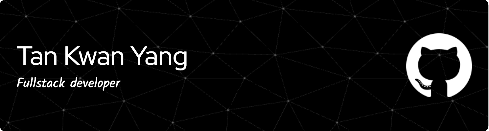

<h3 align="center">Fullstack Developer in Web, Mobile, AI</h3>

I am deeply passionate about computer science, with a strong focus on Software Architecture, Code Design, and AI Integration. I enjoy finding creative solutions to complex problems and building systems that are both scalable and efficient. In my free time, I love exploring new technologies, honing my coding skills, and learning more about AI. When I'm not working on tech, I enjoy activities like hiking, photography, and exploring different cultures through travel.

<h4 align="left">Connect with me: <a href="https://www.linkedin.com/in/kwan-yang-tan-8b4b86232/" target="_blank" rel="noreferrer">LinkedIn</a></h4>

<h3 align="left">Languages and Tools:</h3>

<table>
  <!-- Programming Languages -->
  <tr>
    <th colspan="5" align="center">Programming Languages</th>
  </tr>
  <tr>
    <td align="center" width="96">
      
       Java
    </td>
    <td align="center" width="96">
      
       JavaScript
    </td>
    <td align="center" width="96">
      
       PHP
    </td>
    <td align="center" width="96">
      
       Python
    </td>
    <td align="center" width="96">
      
       TypeScript
    </td>
  </tr>

  <!-- Frameworks & Libraries -->
  <tr>
    <th colspan="5" align="center">Frameworks & Libraries</th>
  </tr>
  <tr>
    <td align="center" width="96">
      
       Laravel
    </td>
    <td align="center" width="96">
      
       React
    </td>
    <td align="center" width="96">
      
       Redux
    </td>
    <td align="center" width="96">
      
       Flutter
    </td>
    <td align="center" width="96">
      
       Flask
    </td>
  </tr>

  <!-- Databases -->
  <tr>
    <th colspan="5" align="center">Databases</th>
  </tr>
  <tr>
    <td align="center" width="96">
      
       MySQL
    </td>
    <td align="center" width="96">
      
       PostgreSQL
    </td>
    <td align="center" width="96">
      
       Redis
    </td>
  </tr>

  <!-- Cloud & DevOps Tools -->
  <tr>
    <th colspan="5" align="center">Cloud & DevOps Tools</th>
  </tr>
  <tr>
    <td align="center" width="96">
      
       AWS
    </td>
    <td align="center" width="96">
      
       Docker
    </td>
    <td align="center" width="96">
      
       Git
    </td>
    <td align="center" width="96">
      
       Firebase
    </td>
  </tr>

  <!-- Data Science Tools -->
  <tr>
    <th colspan="5" align="center">Data Science Tools</th>
  </tr>
  <tr>
    <td align="center" width="96">
      
       Pandas
    </td>
    <td align="center" width="96">
      
       Scikit Learn
    </td>
    <td align="center" width="96">
      
       Seaborn
    </td>
  </tr>

  <!-- CSS Tools -->
  <tr>
    <th colspan="5" align="center">CSS Tools</th>
  </tr>
  <tr>
    <td align="center" width="96">
      
       Sass
    </td>
    <td align="center" width="96">
      
       Tailwind CSS
    </td>
  </tr>
</table>

<!--
**kwanyang/kwanyang** is a ✨ _special_ ✨ repository because its `README.md` (this file) appears on your GitHub profile.

Here are some ideas to get you started:

- 🔭 I’m currently working on ...
- 🌱 I’m currently learning ...
- 👯 I’m looking to collaborate on ...
- 🤔 I’m looking for help with ...
- 💬 Ask me about ...
- 📫 How to reach me: ...
- 😄 Pronouns: ...
- ⚡ Fun fact: ...
-->
